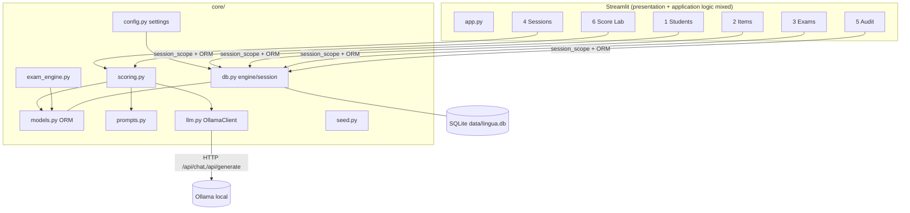
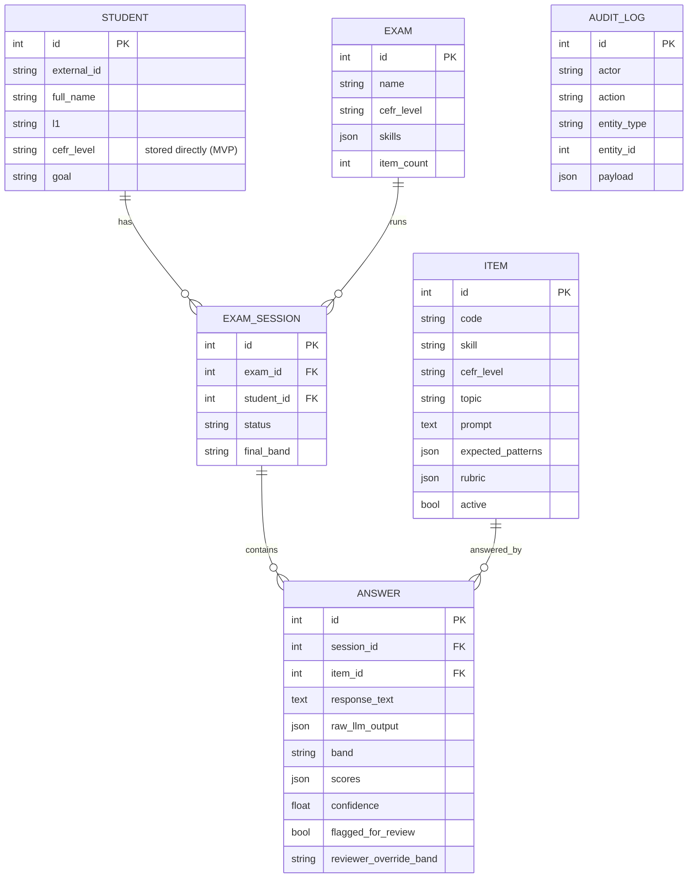

# Current Architecture (MVP)

## Component view



## Existing data model



## Existing scoring flow

```mermaid
sequenceDiagram
  participant U as Expert (Sessions/Score Lab)
  participant SC as core.scoring
  participant PR as core.prompts
  participant LLM as OllamaClient
  participant DB as SQLite

  U->>SC: score_answer(db, answer_id)
  SC->>DB: load Answer + Item
  SC->>PR: build_scoring_user(item, response)
  SC->>LLM: score(SCORER_SYSTEM, user)  [JSON mode]
  alt LLM error
    LLM-->>SC: LLMError
    SC->>DB: record error, confidence=0, flag for review, AuditLog(score_error)
  else success
    LLM-->>SC: strict JSON {band, scores, confidence, feedback...}
    SC->>DB: persist band/scores/confidence; flag if confidence < 0.6 or band missing
    SC->>DB: AuditLog(auto_score)
  end
  U->>SC: apply_override(...) (when AI is wrong)
  SC->>DB: store reviewer override + AuditLog(override_score)
```

## Key behaviors & constraints

- `expire_on_commit=False` is intentional for Streamlit's re-run model.
- SQLite uses `check_same_thread=False`.
- Confidence threshold for review is `0.6` (`core/scoring.CONFIDENCE_THRESHOLD`).
- `_norm_band` defensively normalizes the model's band string to A1–C2.

## Known issues (see REPOSITORY_AUDIT.md §4)

- `core/llm.chat` retry loop never retries (dead code after `break`).
- `core/exam_engine.generate_exam` doesn't persist an exam→item snapshot.
- No migrations/tests before this milestone; UI reaches into ORM directly.
