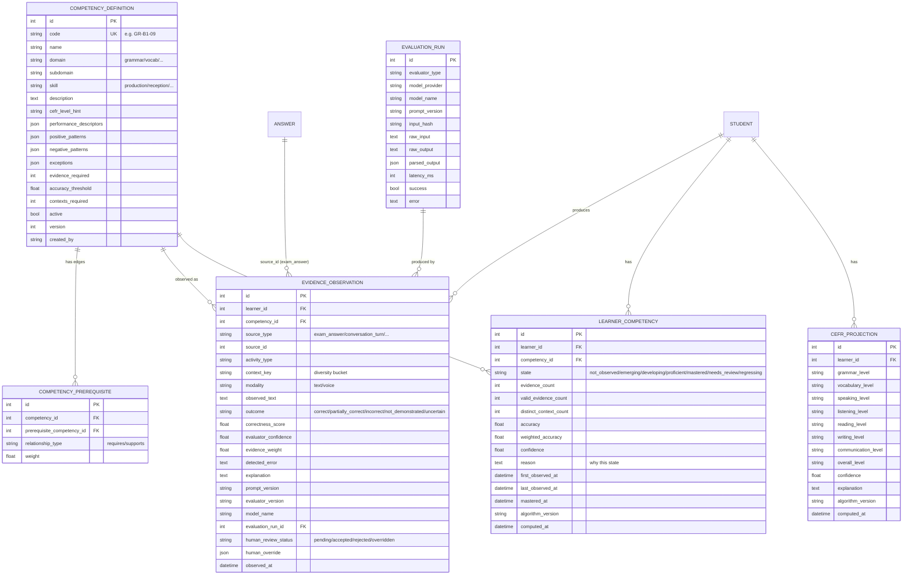

# Data Model

The existing assessment tables (`students`, `items`, `exams`, `exam_sessions`,
`answers`, `audit_log`) are **unchanged**. This milestone adds new, additive
tables for the competency domain. CEFR remains on `students.cefr_level` for
backward compatibility but is **no longer authoritative** (ADR-002).

## New entities (this milestone)



## Constraints & indexes

- `competency_definitions.code` is **unique** (catalog integrity).
- `competency_prerequisites`: unique `(competency_id, prerequisite_competency_id)`;
  both FK → `competency_definitions.id`; self-reference forbidden in validation.
- `evidence_observations`: indexes on `(learner_id, competency_id)`,
  `source_type, source_id`; FK `learner_id → students.id`,
  `competency_id → competency_definitions.id`,
  `evaluation_run_id → evaluation_runs.id`.
- `learner_competencies`: **unique** `(learner_id, competency_id)` — it is a
  projection (one row per learner×competency), rebuildable from observations.
- All timestamps default to UTC; all JSON columns hold lists/objects only.

## Why `LearnerCompetency` and `CEFRProjection` are projections, not truth

They are **derived**: a pure function of (valid observations, competency
thresholds, algorithm version). They can be dropped and rebuilt with no data
loss. Raw truth lives in `evidence_observations` (+ human overrides). This is
what makes every learner state **traceable** and **reproducible** (ADR-005).

## Evidence weighting (summary; full algorithm in progress engine)

`evidence_weight` combines evaluator confidence, human-review status
(human-accepted > AI-only; rejected = excluded), recency, and modality. The
deterministic engine then requires, for mastery:

```
valid_evidence_count   >= competency.evidence_required
AND weighted_accuracy  >= competency.accuracy_threshold
AND distinct_context   >= competency.contexts_required
AND projection_confidence >= configured_minimum
```

One correct answer can never satisfy these (count and context gates). See
`core/progress/engine.py` and `docs/decisions/ADR-005`.

## Migration / rollback

- Baseline migration captures the existing 6 tables (already stamped on the live
  DB so current data is untouched).
- The milestone migration is **additive** (only `CREATE TABLE`/index). Its
  `downgrade()` drops only the new tables. SQLite-safe via `render_as_batch`;
  PostgreSQL-compatible types. See `docs/ROADMAP.md` §Migration commands.
