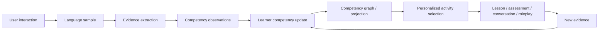

# Product Vision — Lingua Nova / AI Teacher Platform

## From assessment machine to AI teacher

Today the platform answers _"what band is this answer?"_. The destination is a
platform that maintains a **living competency profile** for every learner and
teaches against it continuously.

A learner is never reduced to "Student X is B1." Instead they hold hundreds of
measurable abilities, and their profile is deliberately **uneven**: e.g. B2
reading, B1 speaking, A2 listening; strong conditionals, weak articles,
developing formal register, strong travel vocabulary, weak academic collocations.

## The continuous learning loop

CEFR (A1–C2) is **computed from** the competency graph; it is a projection, not
the source of truth.

## Non-negotiable domain rules

1. **Competencies are the source of truth.** CEFR is a derived projection.
2. **Never declare mastery from one answer.** Mastery needs accumulated evidence.
3. **Context diversity matters.** Evidence must come from multiple contexts /
   activity types, not one repeated exercise.
4. **The LLM does not make the final mastery decision.** It analyzes, detects,
   suggests, and explains; a deterministic engine decides state and mastery.
5. **Every conclusion is traceable** to its source evidence (what was said, which
   activity, which competency, correctness, evaluator version, confidence,
   human review status, and why the score changed).
6. **Human expert authority.** Experts create/edit competencies and thresholds,
   review/reject observations, override scores, invalidate evidence, and inspect
   why a level was assigned.
7. **Version everything important** (prompts, models, evaluators, rubrics,
   competency definitions, algorithms, projections) for reproducibility.
8. **Local-first and privacy-first.** Ollama stays the default; AI providers sit
   behind interfaces so hosted providers can be added later.

## What the existing MVP becomes

The current assessment + audit functionality is **preserved** and becomes one
**source of evidence** (`source_type = exam_answer`) feeding the competency
graph — not removed, not rewritten.

## Guardrails (what we are deliberately NOT doing yet)

No microservices, no Kafka, no graph DB, no vector DB without a concrete need,
no swarm of autonomous agents, no fine-tuning before reliable expert-reviewed
data, no Next.js rewrite during the foundation. Boring, inspectable, testable
architecture first.
