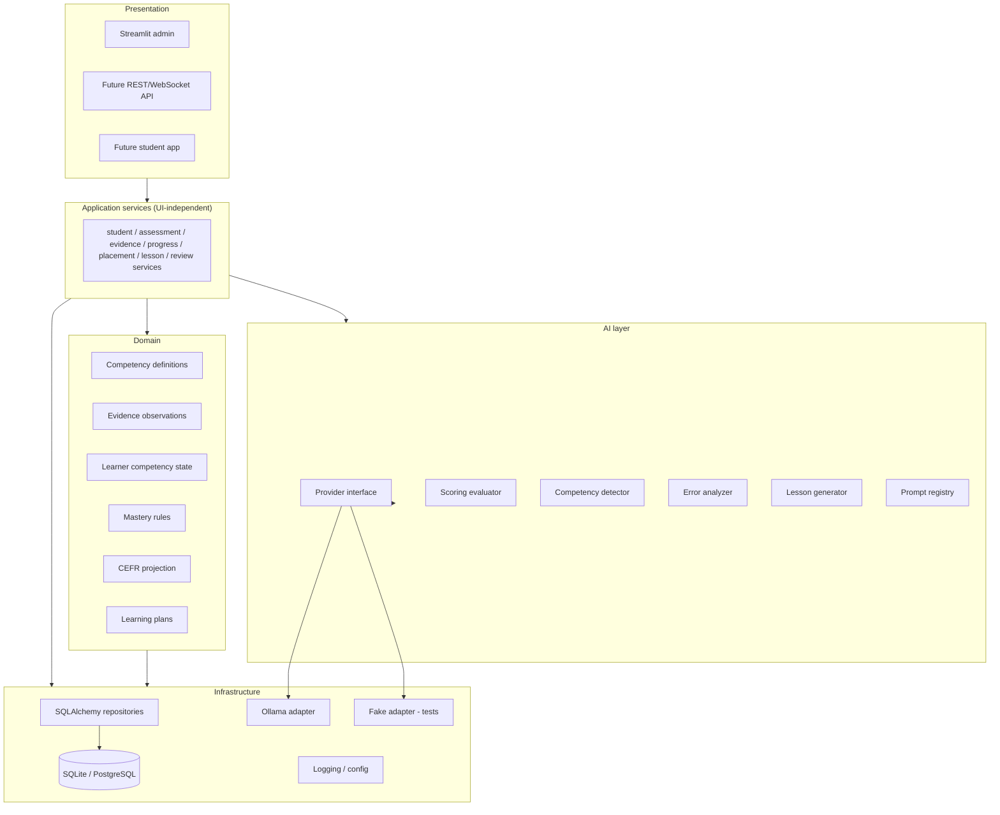
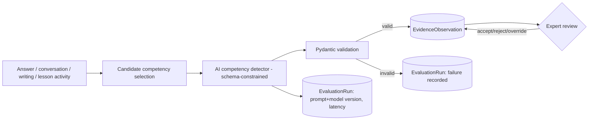
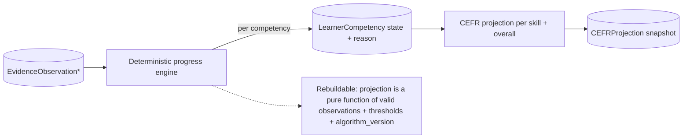
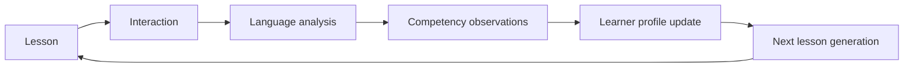

# Target Architecture

A **modular monolith** (no microservices yet). The learner knowledge graph is
represented relationally (competencies + prerequisite edge table), not in a graph
database. We migrate toward the structure below **incrementally**, preserving
working imports — no big-bang relocation.

## Layered view



## Evidence flow (new)



## Competency projection flow (new)



## Continuous learning loop (target)



## Target folder structure (incremental destination)

```
src/
  domain/        competencies/ evidence/ learners/ assessment/ progress/ lessons/
  application/   services/ commands/ queries/ dto/
  infrastructure/database/ repositories/ ai_providers/ storage/
  ai/            prompts/ schemas/ evaluators/ generators/
  interfaces/    streamlit/ api/
tests/           unit/ integration/ contract/ evaluation/
migrations/  data/competency_catalogs/  docs/decisions/
```

### Interim mapping (this milestone)

We do **not** relocate yet. The new code lives in additive packages under
`core/` that mirror the destination layers, so a later move is mechanical:

| Target layer | Interim location (this milestone) |
|---|---|
| domain (competency/evidence/progress) | `core/competency/`, `core/evidence/`, `core/progress/` |
| AI provider interface + adapters | `core/ai/` |
| infrastructure repositories | `core/competency/repository.py` |
| interfaces | existing `pages/`, new `pages/7_🧠_Competencies.py` |

## Design principles

- Mastery and CEFR logic live in **deterministic, testable domain code** — never
  in prompts or Streamlit.
- AI is always behind a `LanguageModelProvider` interface; tests use a fake.
- Projections are **pure functions** of valid observations → fully rebuildable.
- Everything important is **versioned** and **traceable**.
